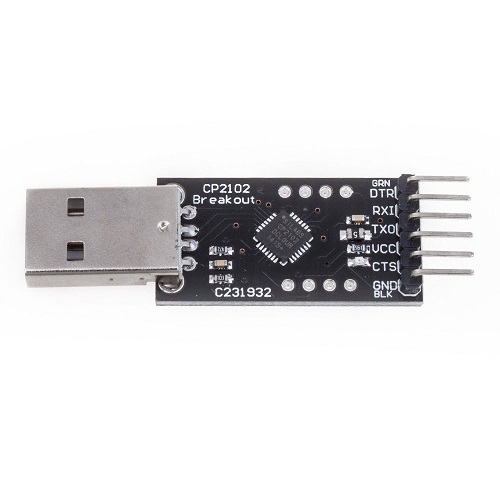
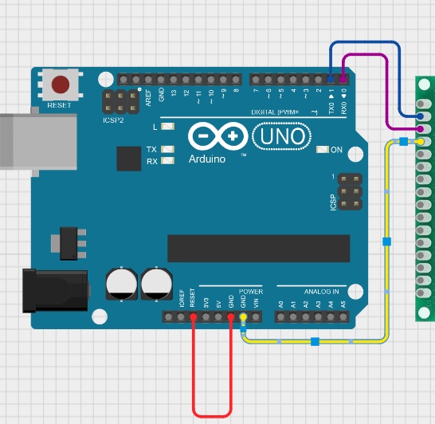
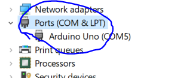
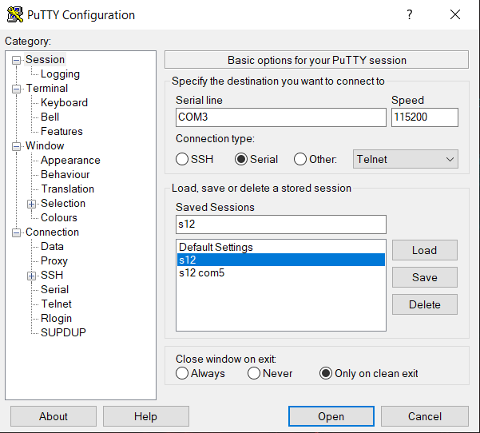
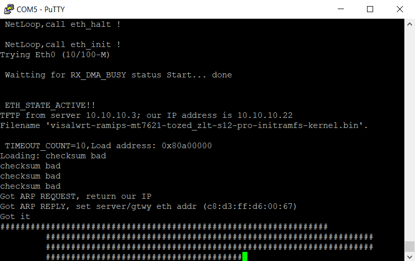
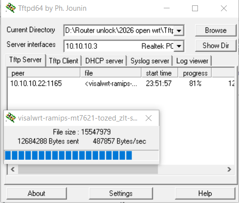

# 📦 Installation Guide (VisalWRT Firmware)

Follow the steps below to install VisalWRT firmware on the ZLT S12 Pro router.

---

## 🧰 Requirements

Before starting, download and prepare the following:

- VisalWRT firmware file  
- CP2102 USB to Serial driver  
- Tftpd64 (TFTP server)  
- PuTTY (SSH/Serial client)  

---

## 🔌 Step 1: Setup Serial Connection

You need a serial connection to access the router bootloader.

### Option 1: Using CP2102 USB to Serial Adapter

1. Install CP2102 drivers on your PC  
2. Connect the CP2102 module to the router  
3. Open **Computer Management → Device Manager**  
4. Check the assigned COM port  

📷 CP2102 Serial Adapter  

---

### Option 2: Using Arduino as Serial Adapter

1. Connect **RESET pin to GND** on Arduino  
2. Use it as a USB to Serial converter  
3. Connect TX/RX to router  

📷 Arduino Serial Setup  

---

### Check COM Port

Go to: Computer Management → Device Manager → Ports (COM & LPT)

📷 COM Port View  

---

## 🌐 Step 2: Configure Network Settings

1. Open: Control Panel → Network and Internet → Network Connections

📷 Network Settings  

---

2. Open **Ethernet → Properties**

📷 Ethernet Settings  

---

3. Select **Internet Protocol Version 4 (IPv4)** and set:

- IP Address: `10.10.10.1`
- Subnet Mask: `255.0.0.0`
- Default Gateway: `10.10.10.3`

📷 IP Configuration  

---

## 📡 Step 3: Setup TFTP Server

1. Open **Tftpd64**
2. Set working directory to firmware folder
3. Place firmware file: visalwrt-ramips-mt7621-tozed_zlt-s12-pro-initramfs-kernel.bin

---

## 💻 Step 4: Setup PuTTY (Serial Connection)

Open PuTTY and configure:

- Connection Type: `Serial`
- Serial Line: `COMx` (your port)
- Speed: `115200`

📷 PuTTY Settings  

---

## 🔁 Step 5: Enter Bootloader Mode

1. Connect router via serial  
2. Power ON router  
3. Immediately press **"1" repeatedly**  

This will enter the bootloader menu.

---

## 📥 Step 6: Start TFTP Flash

1. After pressing "1", you will see an IP prompt  
2. Press **Enter** to accept first IP  
3. Press **Enter again** for second IP  
4. TFTP transfer will begin  

📷 TFTP Process  
  

---

## ⚡ Step 7: Flashing Process

- Firmware will upload automatically  
- Router will flash the firmware  
- Router will reboot after completion  

---

## 🔐 Step 8: Login to Router

After reboot:

- Open browser: `http://192.168.1.1`

Login details:

- Username: `root`
- Password: `admin`

📷 Boot Process  

---

## ⚠️ Important Notes

- Do NOT power off during flashing  
- First boot may take 2–3 minutes  
- Ensure correct firmware file is used  
- Serial connection is required for recovery mode  

---

# ✅ Done

Your router should now be running **VisalWRT firmware** successfully.