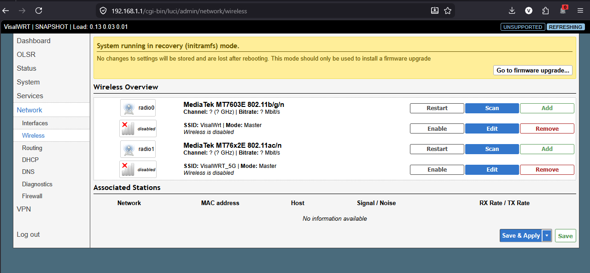
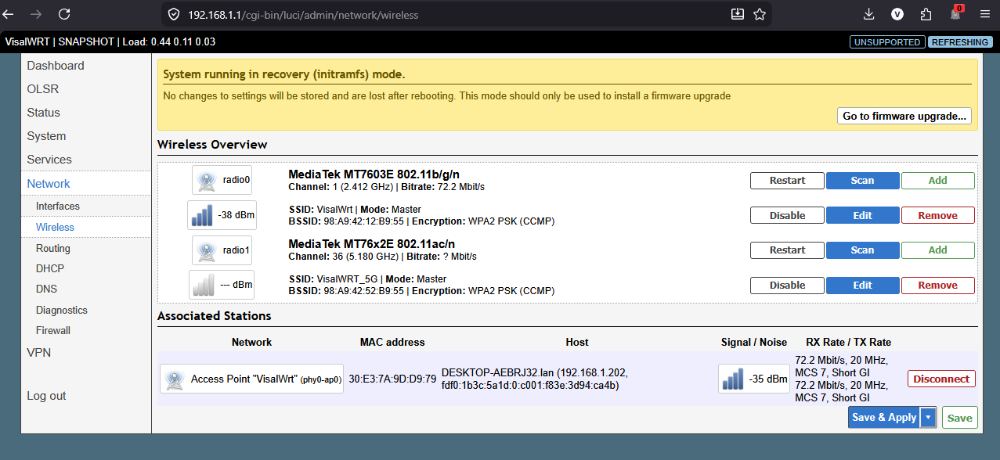
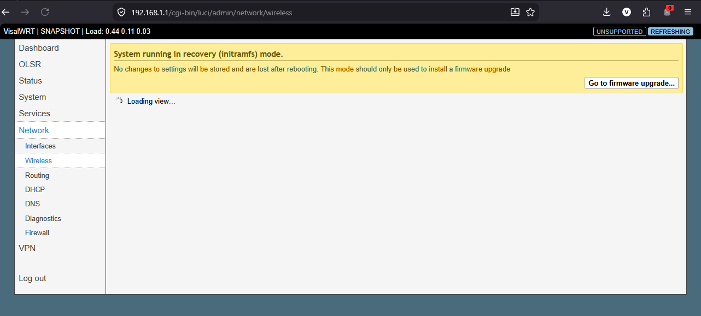
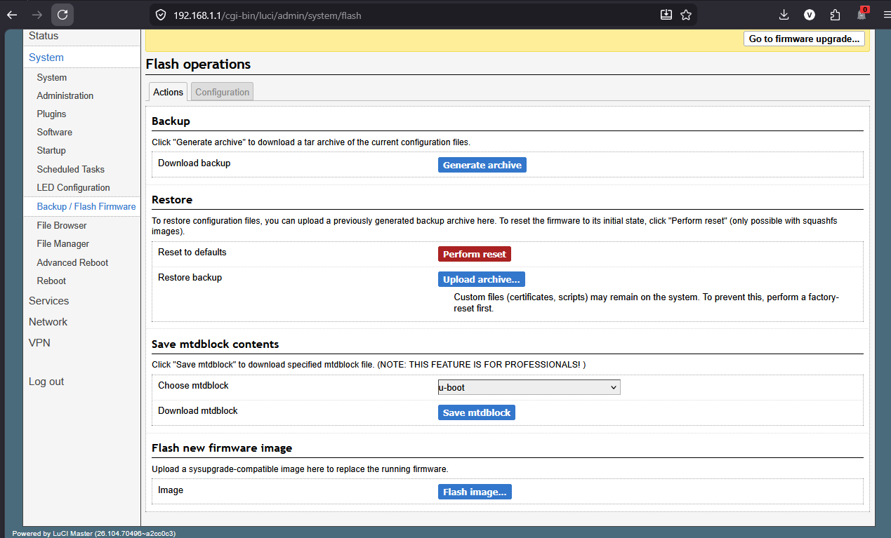
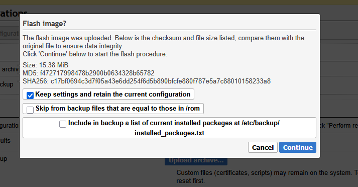

#  WiFi Setup & Firmware Upgrade Guide (VisalWRT)

This guide explains how to access the router, enable WiFi, and perform firmware upgrade on VisalWRT.

---

#  Step 1: Connect to Router

- Use an Ethernet cable
- Connect it to **LAN Port 4** of the router

---

#  Step 2: Access Web Interface

Open your browser and go to: http://192.168.1.1/

Login credentials:

- Username: `root`
- Password: `admin`

---

#  Step 3: Enable WiFi

Go to: Network → Wireless

Screenshot:

---

Enable both:

- 2.4 GHz WiFi
- 5 GHz WiFi

Screenshot:

---

#  Step 4: Firmware Upgrade

Go to: System → Firmware Upgrade

 Screenshot:

---

Click: Flash Image

 Screenshot:

---

#  Step 5: Upload Firmware

Upload the file: visalwrt-ramips-mt7621-tozed_zlt-s12-pro-squashfs-sysupgrade.bin

Then click **Continue**

 Screenshot:

---

#  Important Notes

- Do NOT power off the router during upgrade
- Wait until reboot completes automatically
- Use only LAN connection during flashing

---

#  Result

After reboot:
- WiFi (2.4GHz + 5GHz) will be active
- VisalWRT firmware will be installed successfully

